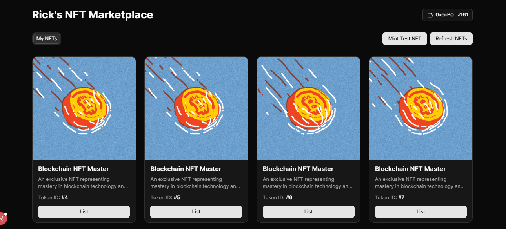

# NFT Marketplace Frontend

A fully functional NFT marketplace frontend built with NextJS, integrating Web3 technologies for seamless user experience. Users can browse, list, and buy NFTs with ease using Metamask and the WAGMI library.

## 🚀 Live Demo
[Visit the App](https://nft-marketplace-front-chi.vercel.app/)

## 🛠️ Technologies Used

- **NextJS** - Modern React framework for fast, scalable frontend development.
- **Solidity** - Smart contract programming language used for the NFT marketplace logic.
- **Foundry** - Robust development environment for testing and deploying Solidity contracts.
- **Alchemy API** - Blockchain API for querying NFT data and interacting with smart contracts.
- **Alchemy Webhooks** - Real-time webhook notifications for blockchain events.
- **WAGMI React Hooks** - Efficient React hooks for Web3 integration and contract interaction.
- **Metamask** - Browser wallet extension for seamless Ethereum transactions.

## 📋 Features

✅ List your NFTs for sale directly from the interface  
✅ View your owned NFTs with detailed information  
✅ Mint Test NFTs
✅ Clean and responsive UI designed with NextJS
